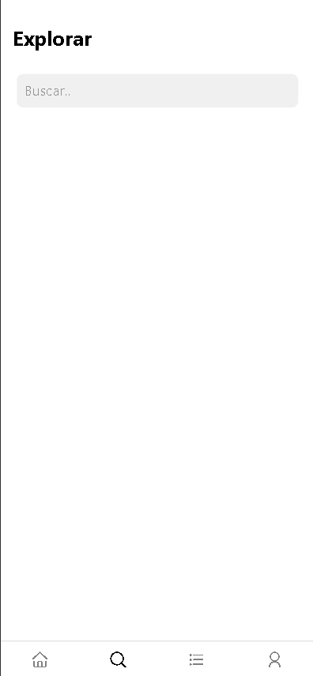
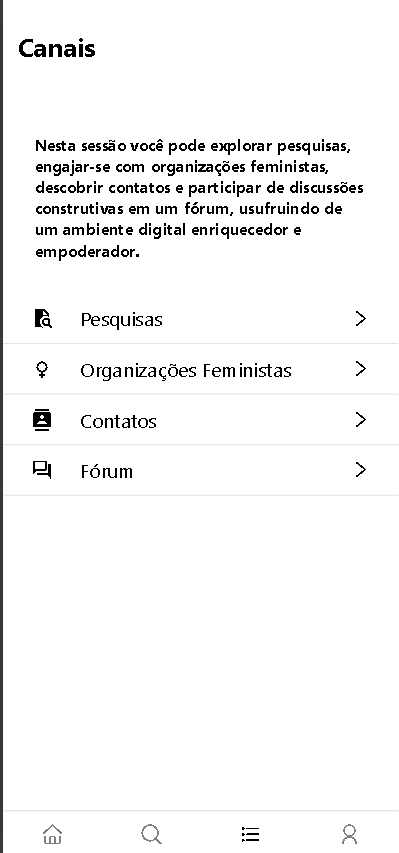

## Projeto "Mani"

## Introdução

O aplicativo "Mani" foi idealizado como parte de uma pesquisa abrangente sobre a violência de gênero e o acesso aos serviços de saúde por mulheres rurais e ribeirinhas. Este produto tecnológico visa fornecer uma plataforma acessível e eficiente para coleta e disseminação de informações, além de suporte aos usuários.

#### Tecnologias Utilizadas

- **React Native**: Framework de desenvolvimento de aplicativos móveis para iOS e Android usando JavaScript.
- **Figma**: Editor gráfico de vetor e plataforma de prototipagem para design de projetos.
- **Node.js**: Ambiente de execução de código JavaScript fora do navegador.
- **Express.js**: Framework para otimização de construção de aplicações web e APIs.
- **MongoDB**: Software de banco de dados NoSQL.
- **Expo**: Plataforma de código aberto para criar aplicativos nativos universais para Android, iOS e Web.
- **Mongoose**: Biblioteca do Node.js que fornece uma camada de abstração para interagir com o MongoDB.
- **Cloudinary**: Plataforma de gerenciamento de mídia baseada em nuvem.
- **Postman**: Ferramenta de desenvolvimento de API para testar e interagir com APIs.
- **Axios**: Biblioteca JavaScript para fazer requisições HTTP a servidores.
- **CORS**: Conjunto de cabeçalhos HTTP que controlam solicitações e respostas entre diferentes origens.

## Demonstrações
### Home

  

### Explorar e Canais

  
  

### Pesquisas

  
  
  

## Licença

Este projeto está licenciado sob a Licença MIT. Consulte o arquivo [LICENSE](LICENSE) para obter mais informações.
